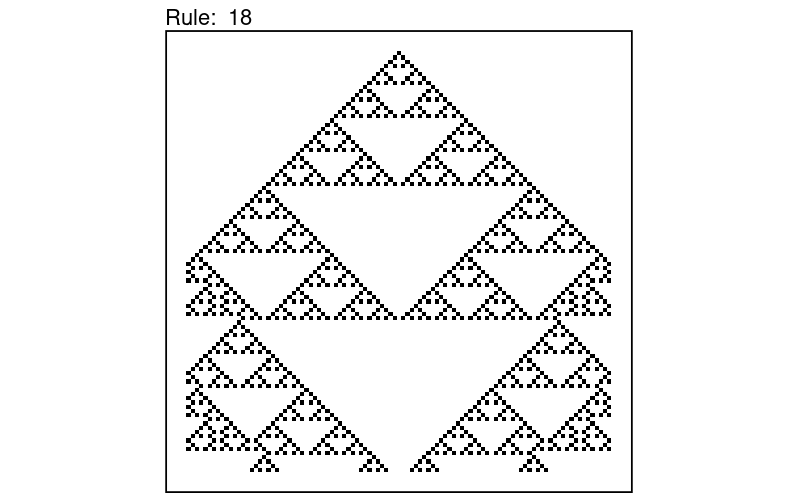
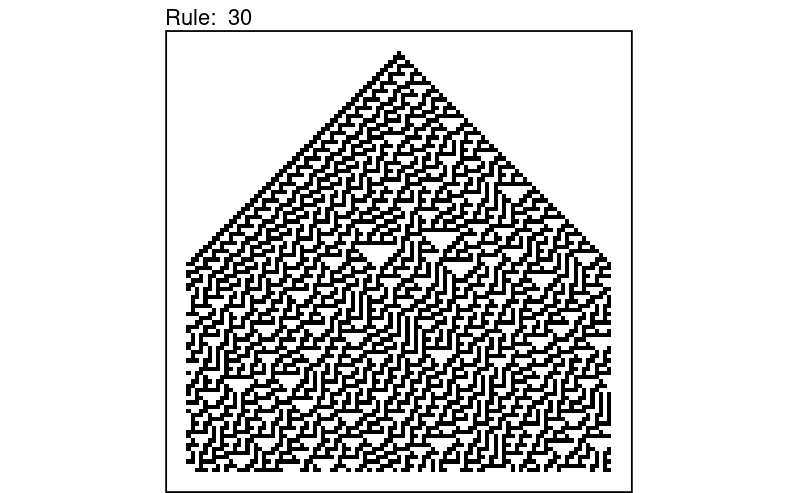
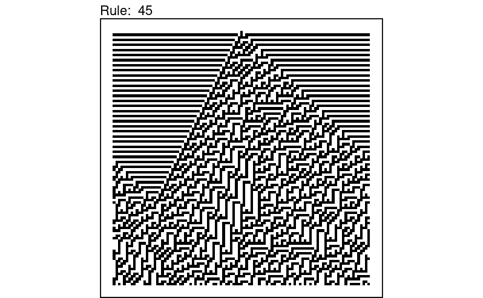
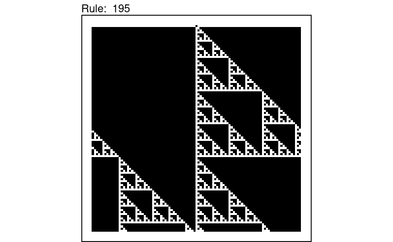
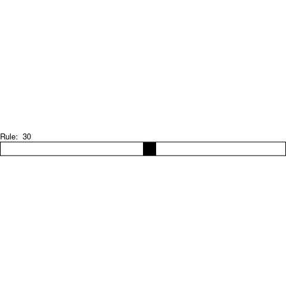
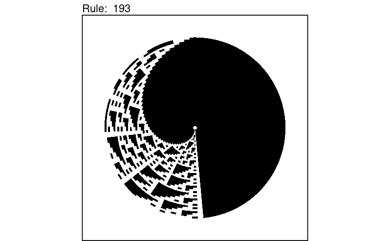
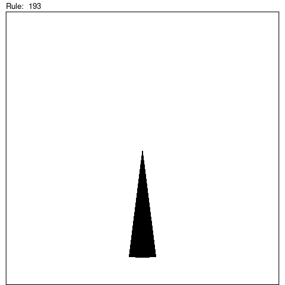

An R package for creating cellular automata.

```{r}
library(cellularautomata)
```

## Create the plot of a cellular automaton

You can generate a cellular automaton using the `ca` function, specifying the Wolfram rule. For example:

```{r}
ca(18) |> plot()
ca(30) |> plot()
ca(45) |> plot()
ca(195) |> plot()
```









## Animations

You can get an animation of a cellular automaton using `plot(animate = TRUE)`:

```{r}
ca(30, ncols = 20, steps = 30) |> plot(animate = TRUE)
```



## Polar coordinates

By default the line is wrapped, meaning it is actually a circle, with the end connected to the beginning.

You can plot it using polar coordinates:

```{r}
ca(193, steps = 50) |> plot(time_flow = "up", circle = TRUE)
```



This also works for animations:

```{r}
ca(193, ncols = 25, steps = 100) |> plot(circle = TRUE, animate = TRUE)
```



## Acknowledgements

Original function created by [Nicola Procopio](https://github.com/nickprock/automata2graph).
